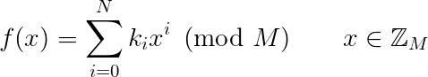

# ChumpCrypt Cipher

## Specification
ChumpCrypt is a revolutionary new cryptographic cipher that favours simplicity and elegance over unnecessarily convoluted and impenetrable computer science. Encryption is as simple as evaluating a polynomial:

ChumpCrypt operates as a block ciper with a block size of 8 bits. Choose a password to act as your key, then split it into ASCII bytes - these will make up your <tt>ki</tt>s above. <tt>N</tt> is the length of your password.  

Next, choose a prime modulus <tt>M > 256</tt>. This serves as an [Initialization Vector](https://en.wikipedia.org/wiki/Initialization_vector) and should be unique per ciphertext to prevent replay attacks.  

Now to encrypt your plaintext, split it into bytes and pass each of them through the encryption function above to yield the corresponding ciphertext bytes. Simples!  

Sample encryptor code is included in the GitHub project. 

* Please don't use a CTF flag as your key  
** Derivation of the decryption formula is left as an exercise for the reader